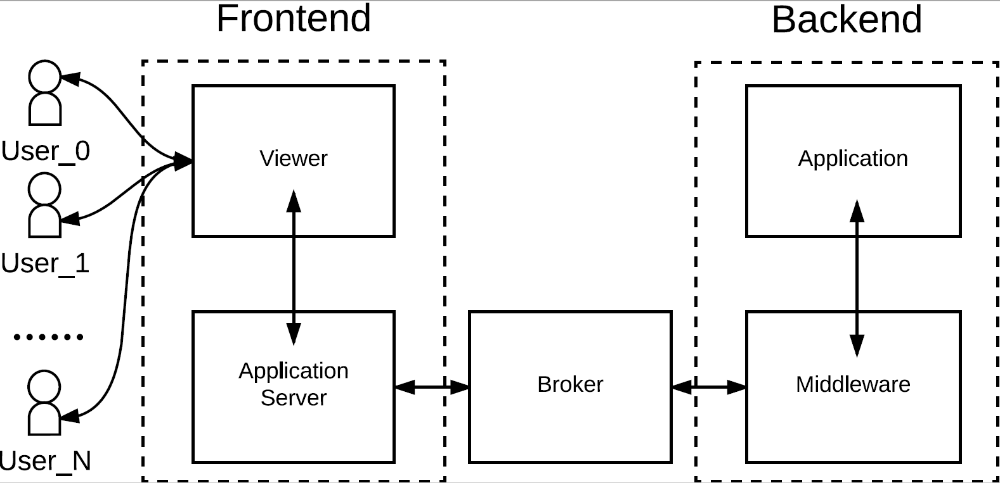

# ACTS : A City Traffic Simulator

## Version: 1.0.0

_Authors:_
* Gianmarco Midena
* Stefano Munari
* Sebastiano Valle

**The team worked cohesively to ACTS.
The commit history does _not_ reflect the actual
development history of this project.**

Project for the [Concurrent and Distributed Systems course 2015/2016](http://www.math.unipd.it/~tullio/SCD/2015/)
at [University of Padua - MSc level](http://informatica.math.unipd.it/laureamagistrale/indexen.html).

Documentation of the ACTS project can be found at [this link](https://github.com/StefanoMunari/acts-docs/releases/download/release-1.0-report/atcs-report-v1.0.0.pdf).

This repository includes the source code of the ACTS simulator, divided as
follows:

* `app/backend`: source code of the Application Layer for the backend
* `app/frontend`: source code of the application frontend (Application Server + User Viewer)
* `broker_to_as`: source code of the intermediate Broker component
* `mw`: source code of the Middleware Layer for the backend
* `<ROOT_DIR>`: scripts to build, run and clean the system

A quick guide for our simulator can be found at [this link](https://github.com/StefanoMunari/acts-docs/releases/download/v1.0.0-user-manual/user-manual-v1.0.0.pdf).

## Brief description

ACTS is a heterogeneous distributed system which is able to simulate the
traffic of a city.

Its architecture is represented by the following figure:

Users can watch simulations by means of a frontend, which is composed
of a [User Viewer](app/frontend/apps/interface/web/) and an [Application
Server](app/frontend/).

Each simulation for a city happens thanks to three components:

* The [Application Layer](app/backend), written in Ada and C++, handles all of
  the domain logic;
* The [Middleware Layer](mw/), written in Elixir, enables the application to
  be distributed;
* The [intermediate Broker](broker_to_as/), written in Elixir, pre-process the
  events before forwarding them to the frontend.
